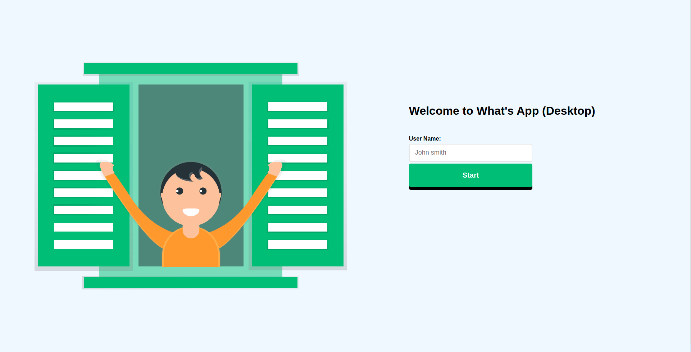
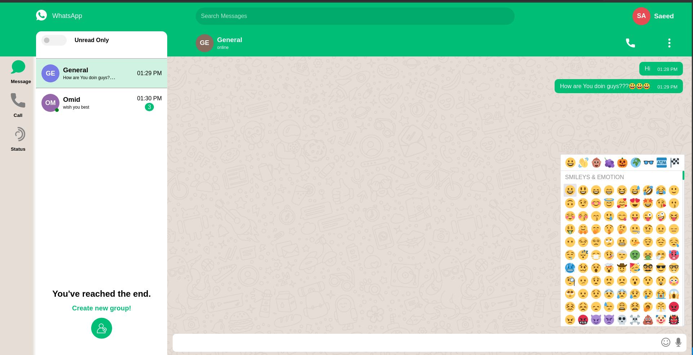
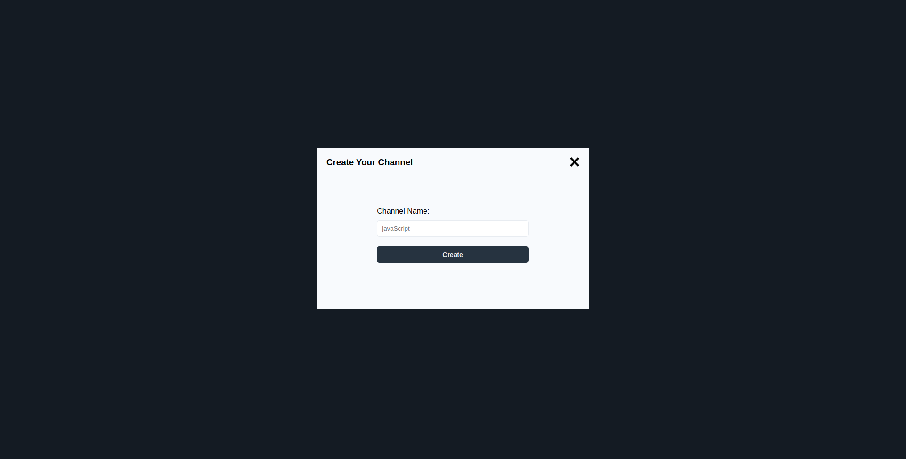
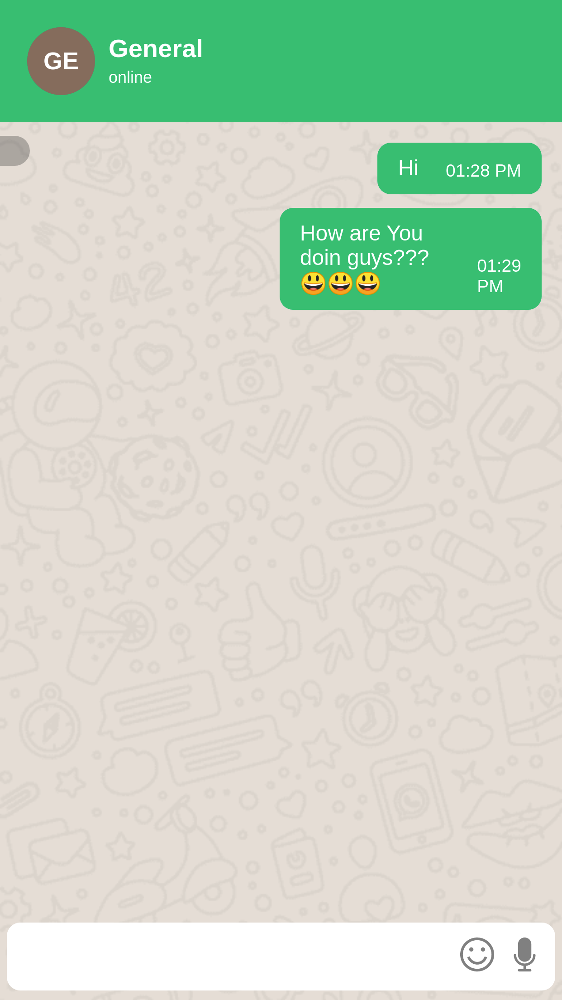
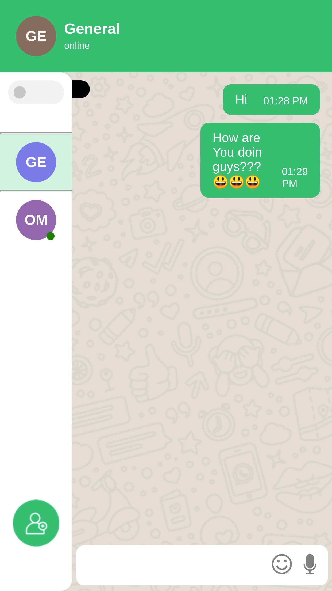

# Description

This is a WhatsApp Web Clone with React.js & express.js
In the Server folder we run our server which it's main job is running socket.io to send messages to other contacts.

## Features

Create Group - Join Group - Send message in private or in group - play sound when sending a message and recieve - show notification when get message(if you are not on that chat) - Fully responsive - New design & ...

# Screen Shots

## Sign In

## Main page

## create Group

## responsive

## Available Scripts

In the project directory, you can run:

### `npm start`

Runs the app in the development mode.\
Open [http://localhost:3000](http://localhost:3000) to view it in the browser.

### `npm run build`

Builds the app for production to the `build` folder.\
